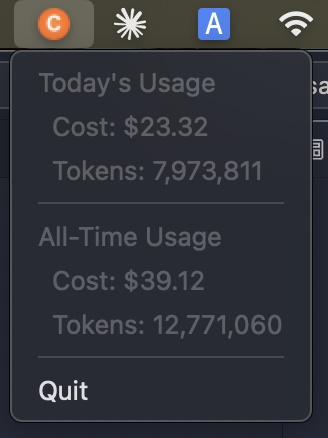

🎉 **Special Thanks** to [ccusage](https://github.com/ryoppippi/ccusage) for providing the core usage analysis functionality!

#  Claude Usage Tracker for Mac 

🍊 macOS menu bar app to visualize Claude Code usage costs



## Overview

A clean, lightweight menu bar application that displays your Claude Code usage statistics directly in the macOS menu bar. Built with TypeScript and Electron, utilizing the [ccusage](https://www.npmjs.com/package/ccusage) library to read local usage history files.

## Features

- 📊 **Real-time Usage Display**: Shows today's and all-time usage in the menu bar
- 💰 **Cost Tracking**: Displays both token count and cost information
- 🔒 **Privacy-First**: Only reads local files, no data transmission
- 🎨 **Native Design**: Follows macOS design guidelines with orange accent color
- ⚡ **Lightweight**: Minimal resource usage with efficient architecture


## Installation

### Via 🍺 Homebrew (Recommended)

```bash
# Add the tap
brew tap penicillin0/claude-usage-tracker

# Install the app
brew install claude-usage-tracker
```

To update to the latest version:

```bash
# Update the tap
brew update

# Upgrade the app
brew upgrade claude-usage-tracker
```

### Direct Download

Download the latest release from the [GitHub Releases](https://github.com/penicillin0/claude-usage-tracker-for-mac/releases) page.

### Build from Source

```bash
# Clone the repository
git clone https://github.com/penicillin0/claude-usage-tracker-for-mac.git
cd claude-usage-tracker-for-mac

# Install dependencies
npm install

# Build and run
npm run build
npm start
```


### via 🍎 Apple Store 🍎

coming soon...


## Development

```bash
# Development mode (with auto-reload)
npm run dev

# Build TypeScript
npm run build

# Code quality
npm run lint      # Check linting
npm run format    # Format code
npm run check     # Run all checks
```

## Architecture

The application follows a clean, modular architecture:

```
src/
├── main.ts     # Application entry point
├── types.ts    # TypeScript type definitions
├── usage.ts    # Usage data fetching logic
└── tray.ts     # Tray menu management
```

## Technology Stack

- **TypeScript** - Type-safe development
- **Electron** - Cross-platform desktop app framework
- **ccusage** - Claude Code usage analysis library
- **Biome** - Fast linting and formatting


## Requirements

- macOS (primary target platform)
- Node.js 18+
- Active Claude Code usage history

## Contributing

1. Fork the repository
2. Create your feature branch (`git checkout -b feature/amazing-feature`)
3. Commit your changes (`git commit -m 'Add amazing feature'`)
4. Push to the branch (`git push origin feature/amazing-feature`)
5. Open a Pull Request

## Disclaimer

⚠️ **Important Notice**

This application is an **unofficial**, third-party tool and is **NOT affiliated with, endorsed by, or supported by Anthropic**.

- **Accuracy**: While we strive for accuracy, the usage data displayed may not match your official Anthropic billing. Always refer to your official Anthropic account for authoritative usage and billing information.

- **Data Source**: This app reads local Claude Code usage files via the `ccusage` library. The accuracy depends on the completeness and correctness of these local files.

- **No Warranty**: This software is provided "as is" without any warranty. Use at your own risk.

- **Privacy**: This app only reads local files and does not transmit any data to external servers. However, users should verify the source code if privacy is a concern.

- **Billing Responsibility**: Users are solely responsible for monitoring their actual Anthropic usage and billing through official channels.

For official usage tracking and billing information, please visit [Anthropic's official website](https://console.anthropic.com/).

## License

This project is licensed under the MIT License - see the [LICENSE](LICENSE) file for details.
