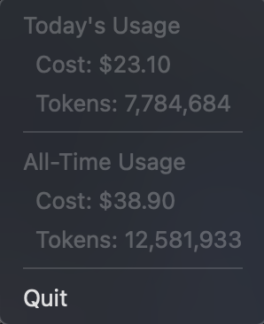

🎉 **Special Thanks** to [ccusage](https://www.npmjs.com/package/ccusage) for providing the core usage analysis functionality!

# Claude Usage Tracker for Mac

🍊 macOS menu bar app to visualize Claude Code usage costs



## Overview

A clean, lightweight menu bar application that displays your Claude Code usage statistics directly in the macOS menu bar. Built with TypeScript and Electron, utilizing the [ccusage](https://www.npmjs.com/package/ccusage) library to read local usage history files.

## Features

- 📊 **Real-time Usage Display**: Shows today's and all-time usage in the menu bar
- 💰 **Cost Tracking**: Displays both token count and cost information
- 🔒 **Privacy-First**: Only reads local files, no data transmission
- 🎨 **Native Design**: Follows macOS design guidelines with orange accent color
- ⚡ **Lightweight**: Minimal resource usage with efficient architecture


## Installation

### via manually

```bash
# Clone the repository
git clone https://github.com/your-username/claude-usage-tracker-for-mac.git
cd claude-usage-tracker-for-mac

# Install dependencies
npm install

# Build and run
npm run build
npm start
```

### via Homebrew

coming soon...

### via Apple Store

coming soon...


## Development

```bash
# Development mode (with auto-reload)
npm run dev

# Build TypeScript
npm run build

# Code quality
npm run lint      # Check linting
npm run format    # Format code
npm run check     # Run all checks
```

## Architecture

The application follows a clean, modular architecture:

```
src/
├── main.ts     # Application entry point
├── types.ts    # TypeScript type definitions
├── usage.ts    # Usage data fetching logic
└── tray.ts     # Tray menu management
```

## Technology Stack

- **TypeScript** - Type-safe development
- **Electron** - Cross-platform desktop app framework
- **ccusage** - Claude Code usage analysis library
- **Biome** - Fast linting and formatting


## Requirements

- macOS (primary target platform)
- Node.js 18+
- Active Claude Code usage history

## Contributing

1. Fork the repository
2. Create your feature branch (`git checkout -b feature/amazing-feature`)
3. Commit your changes (`git commit -m 'Add amazing feature'`)
4. Push to the branch (`git push origin feature/amazing-feature`)
5. Open a Pull Request

## License

This project is licensed under the MIT License - see the [LICENSE](LICENSE) file for details.
